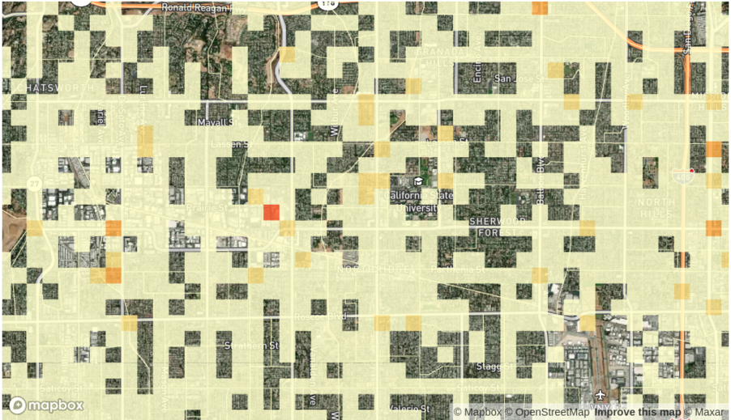

# Prediction: Bias

---

## How We Determined Predictive Policing Software Disproportionately Targeted Low-Income, Black, and Latino Neighborhoods

_Satellite view of the neighborhood of Northridge, in Los Angeles, Calif., with PredPol predictions heat map overlay_

This repository contains the code and data for the analysis we carried out for our [investigation](https://themarkup.org/prediction-bias/2021/12/01/crime-prediction-software-promised-to-be-free-of-biases-new-data-shows-it-perpetuates-them), which is described in detail in our (methodology)[https://themarkup.org/show-your-work/2021/12/01/how-we-determined-crime-prediction-software-disproportionately-targeted-low-income-black-and-latino-neighborhoods]. It relies on the R package [Targets](https://docs.ropensci.org/targets/) to generate a reproducible analysis pipeline.

For the sake of convenience, we've already committed the output from the pipeline to the repository. You will find it in the `out` folder. If you want to re-run the analysis and verify the steps yourself, follow the instructions in the TK section of the Readme.

### Data

In this repository the data used as the input for analysis is stored in the `in` folder, and the dataframes, plots, and findings that are generated from the analysis are stored in the `out` folder. There is also a `datasheets` folder that contains a one-page summary of this analysis for each jurisdiction individually and the raw reports we obtained from PredPol's servers.

#### `in` folder

| Folder or Filename                         | Description                                                                                                                                                                                                                                               |
| :----------------------------------------- | :-------------------------------------------------------------------------------------------------------------------------------------------------------------------------------------------------------------------------------------------------------- |
| `all_jurisdictions.csv`                    | 2018 ACS 5-year population estimates for race and household income.                                                                                                                                                                                       |
| `all_predictions.csv`                      | PredPol predictions for all departments. These have been parsed from the raw HTML reports described in the methodology.                                                                                                                                   |
| `arrests.csv`                              | Arrest records for 13 departments obtained through public records requests.                                                                                                                                                                               |
| `arrests-per-capita.csv`                   | Arrests per capita rates for the departments that provided us with records                                                                                                                                                                                |
| `block-level-prediction-counts.csv`        | Prediction data aggregated to the Census block level, providing information regarding how many days of the analysis window a particular block received predictions.                                                                                       |
| `block-level-prediction-arrest-counts.csv` | Daily arrest and prediction counts at the block level for for 11 jurisdictions in our analysis.                                                                                                                                                           |
| `departments.csv`                          | Metadata for the 38 departments in this analysis.                                                                                                                                                                                                         |
| `housing.csv`                              | Information regarding local and subsidized housing made publicly available by the U.S. Department of Housing and Urban Development.                                                                                                                       |
| `stable-bgs.csv`                           | Stable block groups used in the block level race analysis section of the [methodlogy](https://themarkup.org/show-your-work/2021/12/01/how-we-determined-crime-prediction-software-disproportionately-targeted-low-income-black-and-latino-neighborhoods). |
| `states-geojson`                           | GeoJSON data for the states that the 38 departments of our analysis belong to.                                                                                                                                                                            |
| `ucr.csv`                                  | Race/Ethnicity arrest information made publicly available by the FBI’s Uniform Crime Reporting Program.                                                                                                                                                   |
| `uof.csv`                                  | Use-of-force data for six deparments; obtained through public records requests.                                                                                                                                                                           |

#### `out` folder

| Folder or Filename                 | Description                                                                                                                                                                                                                                                                                                  |
| :--------------------------------- | :----------------------------------------------------------------------------------------------------------------------------------------------------------------------------------------------------------------------------------------------------------------------------------------------------------- |
| `dataframes`                       | Dataframes used to generate the charts in the `plots` folder.                                                                                                                                                                                                                                                |
| `dept_prediction_date_ranges.csv`  | First and last dates from the prediction reports for each department.                                                                                                                                                                                                                                        |
| `dept_usage_dates.csv`             | Date ranges for each department in our analysis. Ranges include predictions, software usage start and end dates confirmed by each department, and the start and end dates used in this analysis.                                                                                                             |
| `findings.pdf`                     | This PDF contains the code and output for the anecdotal information that was included in the methodology.                                                                                                                                                                                                    |
| `jurisdiction-prop-cheatsheet.pdf` | PDF containing demographic proportion information as described in the disparate impact analysis of our [methodology](https://themarkup.org/show-your-work/2021/12/01/how-we-determined-crime-prediction-software-disproportionately-targeted-low-income-black-and-latino-neighborhoods) for each department. |
| `plots`                            | This folder contains all the charts we created during our analysis.                                                                                                                                                                                                                                          |
| `prediction_count.csv`             |                                                                                                                                                                                                                                                                                                              |

#### PredPol (now Geolitica) Reports

You can download the raw PredPol reports used as the basis of this analysis here. TK LINK.
Note: The addresses listed in the prediction reports are the center of the prediction box. The actual predictions encompass the entire box, not just the address marked at the center.

#### Datasheets folder

| Folder or Filename | Description                                                   |
| :----------------- | :------------------------------------------------------------ |
| `datasheet.Rmd`    | R Markdown that generates the datasheet                       |
| `geojson`          | Folder that contains GeoJSON that is used for generating maps |
| `html`             | Folder that contains HTML version of the datasheets           |
| `pdf`              | Folder that contains PDF version of the datasheets            |

### Setup

To run the analysis

- Install the following packages in RStudio using `install.packages`:
  - tidyverse
  - targets
  - glue
  - tarchetypes
  - leaflet
- Download the input data using the `download-data.sh` script. (This script requires `wget` to be installed on your computer)

### Run Analysis

- Run `library(targets)`
- Run `tar_make()`.

Once you folow the setup steps and run `tar_make()`, the entire pipeline will be run and all the analysis artifacts will be generated. The first time around this usually takes about 10 minutes.

If you are running this repository for the first time and have set it up correctly, there should be no difference between what is already in the `out` folder and what is generated after running `tar_make()`.

The `out` folder contains the latest output from the analysis already. If you re-run the pipeline after using `tar_make()` adding the `in` folder, nothing should change if you have the latest `in` folder and codebase.

### Data Sheets

Data sheets looking at each department in our analysis individually. These are also available in PDF form at `datasheets/pdfs`.

| Department            | URL                                                                                                             |
| :-------------------- | :-------------------------------------------------------------------------------------------------------------- |
| alexandriapd          | [Link](https://markup-investigations-policing.s3.us-east-2.amazonaws.com/datasheets/alexandriapd.html)          |
| birminghampd          | [Link](https://markup-investigations-policing.s3.us-east-2.amazonaws.com/datasheets/birminghampd.html)          |
| boonecounty           | [Link](https://markup-investigations-policing.s3.us-east-2.amazonaws.com/datasheets/boonecounty.html)           |
| clovisca              | [Link](https://markup-investigations-policing.s3.us-east-2.amazonaws.com/datasheets/clovisca.html)              |
| cpd                   | [Link](https://markup-investigations-policing.s3.us-east-2.amazonaws.com/datasheets/cpd.html)                   |
| cpso                  | [Link](https://markup-investigations-policing.s3.us-east-2.amazonaws.com/datasheets/cpso.html)                  |
| decaturga             | [Link](https://markup-investigations-policing.s3.us-east-2.amazonaws.com/datasheets/decaturga.html)             |
| elgin                 | [Link](https://markup-investigations-policing.s3.us-east-2.amazonaws.com/datasheets/elgin.html)                 |
| elmonte               | [Link](https://markup-investigations-policing.s3.us-east-2.amazonaws.com/datasheets/elmonte.html)               |
| farmersbranch         | [Link](https://markup-investigations-policing.s3.us-east-2.amazonaws.com/datasheets/farmersbranch.html)         |
| forsythso             | [Link](https://markup-investigations-policing.s3.us-east-2.amazonaws.com/datasheets/forsythso.html)             |
| frederick             | [Link](https://markup-investigations-policing.s3.us-east-2.amazonaws.com/datasheets/frederick.html)             |
| fresnopd              | [Link](https://markup-investigations-policing.s3.us-east-2.amazonaws.com/datasheets/fresnopd.html)              |
| ftmyerspd             | [Link](https://markup-investigations-policing.s3.us-east-2.amazonaws.com/datasheets/ftmyerspd.html)             |
| gloucestertwppd       | [Link](https://markup-investigations-policing.s3.us-east-2.amazonaws.com/datasheets/gloucestertwppd.html)       |
| gvpd                  | [Link](https://markup-investigations-policing.s3.us-east-2.amazonaws.com/datasheets/gvpd.html)                  |
| haverhill             | [Link](https://markup-investigations-policing.s3.us-east-2.amazonaws.com/datasheets/haverhill.html)             |
| homewood              | [Link](https://markup-investigations-policing.s3.us-east-2.amazonaws.com/datasheets/homewood.html)              |
| jacksonvilletx        | [Link](https://markup-investigations-policing.s3.us-east-2.amazonaws.com/datasheets/jacksonvilletx.html)        |
| jeffcomacc            | [Link](https://markup-investigations-policing.s3.us-east-2.amazonaws.com/datasheets/jeffcomacc.html)            |
| la                    | [Link](https://markup-investigations-policing.s3.us-east-2.amazonaws.com/datasheets/la.html)                    |
| livermore             | [Link](https://markup-investigations-policing.s3.us-east-2.amazonaws.com/datasheets/livermore.html)             |
| merced                | [Link](https://markup-investigations-policing.s3.us-east-2.amazonaws.com/datasheets/merced.html)                |
| modesto               | [Link](https://markup-investigations-policing.s3.us-east-2.amazonaws.com/datasheets/modesto.html)               |
| nilespolice           | [Link](https://markup-investigations-policing.s3.us-east-2.amazonaws.com/datasheets/nilespolice.html)           |
| ocalapdcom            | [Link](https://markup-investigations-policing.s3.us-east-2.amazonaws.com/datasheets/ocalapdcom.html)            |
| ocfl                  | [Link](https://markup-investigations-policing.s3.us-east-2.amazonaws.com/datasheets/ocfl.html)                  |
| ocoeepd               | [Link](https://markup-investigations-policing.s3.us-east-2.amazonaws.com/datasheets/ocoeepd.html)               |
| piscataway            | [Link](https://markup-investigations-policing.s3.us-east-2.amazonaws.com/datasheets/piscataway.html)            |
| plainfieldpdnj        | [Link](https://markup-investigations-policing.s3.us-east-2.amazonaws.com/datasheets/plainfieldpdnj.html)        |
| portagemipd           | [Link](https://markup-investigations-policing.s3.us-east-2.amazonaws.com/datasheets/portagemipd.html)           |
| salisbury             | [Link](https://markup-investigations-policing.s3.us-east-2.amazonaws.com/datasheets/salisbury.html)             |
| southjordan           | [Link](https://markup-investigations-policing.s3.us-east-2.amazonaws.com/datasheets/southjordan.html)           |
| tacoma                | [Link](https://markup-investigations-policing.s3.us-east-2.amazonaws.com/datasheets/tacoma.html)                |
| templeterracepd       | [Link](https://markup-investigations-policing.s3.us-east-2.amazonaws.com/datasheets/templeterracepd.html)       |
| tracypd               | [Link](https://markup-investigations-policing.s3.us-east-2.amazonaws.com/datasheets/tracypd.html)               |
| turlockpolice         | [Link](https://markup-investigations-policing.s3.us-east-2.amazonaws.com/datasheets/turlockpolice.html)         |
| westspringfieldpolice | [Link](https://markup-investigations-policing.s3.us-east-2.amazonaws.com/datasheets/westspringfieldpolice.html) |
